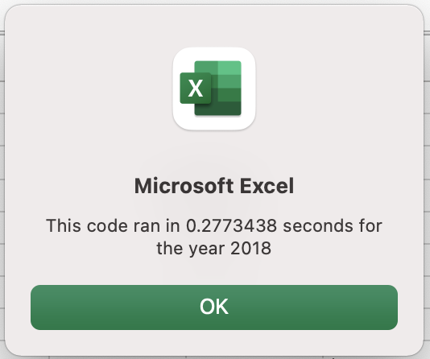

# VBA of Wall Street

## Overview of Project

### Purpose
The purpose of this stock analysis report is to help Steve, a recent business school graduate, evaluate multiple stocks for his parents who are interested in investing in green energy. 

Steve is knowledgeable with Excel and is highly interested in enabling a VBA macro in his workbook (Excel file) to perform financial analysis on different stocks based on their total daily volume and yearly return. 

## Results
Before we continue, the “All Stocks Analysis” and the stock data for 2017 and 2018 used for this analysis is readily available here: [VBA_Challenge](VBA_Challenge.xlsm).

Under the “All Stocks Analysis” tab in the VBA_Challenge workbook we can easily see how stocks in 2017 and 2018 performed with automated formatting and with a click of a button (“Run Analysis for All Stocks”), which was created to run the analysis for a user-friendly experience. Furthermore, an InputBox() command was added so that the user can choose which year to view. InputBox works like MsgBox but contains a text box to get input from the user.

* The following code is used to implement this feature in the VBA script:

```
yearValue = InputBox("What year would you like to run the analysis on?")
```

As stated above, Steve wants to know how stocks performed in 2017 as well as in 2018. One way to measure this is to calculate the yearly return. The yearly return is the percentage difference in price from the beginning of the year to the end of the year. 

Selecting year 2017, we can immediately see that 11 out of 12 stocks had a positive return. DQ was the best performing stock with a 199.4% positive return. SEDG coming at second highest performing stock with a 184.5% positive return for 2017.


Switching to year 2018, we can observe the opposite from positive was performed. The only two stocks that are reflected in the green are RUN and ENPH with an 84% and an 81.9% positive return, respectively.


* To calculate the yearly return in the VBA script the following line of code was added:
 
```
Cells(4 + i, 3).Value = tickerEndingPrices(i) / tickerStartingPrices(i) – 1
```

* However, we first had to find the tickerStartingPrices as well as the tickerEndingPrices to get the yearly return. These lines of codes were used with an **If-Then statement** as shown below:

```
If Cells(i - 1, 1).Value <> tickers(TickerIndex) And Cells(i, 1).Value = tickers(TickerIndex) Then
     
     tickerStartingPrices(TickerIndex) = Cells(i, 6).Value

End If

If Cells(i + 1, 1).Value <> tickers(TickerIndex) And Cells(i, 1).Value = tickers(TickerIndex) Then
     
     tickerEndingPrices(TickerIndex) = Cells(i, 6).Value
                
TickerIndex = TickerIndex + 1
            
End If
```

* The block of code above is performed inside a for loop and the TickerIndex was set to equal to zero before it loops over the rows of stocks.

Additionally, we can assess how stocks performed based on their Total Daily Volume. Daily volume is the total number of shares traded throughout the day; it measures how actively a stock is traded. 

* This line of code was added to calculate the Total Daily Volume:

```
tickerVolumes(TickerIndex) = tickerVolumes(TickerIndex) + Cells(i, 8).Value
```

We can see stock SPWR had the highest volume of shares traded at 782,187,000 and stock FSLR at second highest volume of shares traded at 684,181,400 throughout 2017. Both stocks yielding positive returns for the year at 23.1% and 101.3%, respectively.

Looking at 2018, the only two stocks with a positive return had the highest volume of shares traded. Stock ENPH at 607,472,500 and stock RUN at 502,757,100. 

Steve’s parents had initially invested in DQ, DAQO New Energy Corp, stocks although its stock dropped to 63% in 2018. This has made Steve reevaluate his parents’ investment to a better performing stock. Perhaps Steve can suggest diversifying their investment portfolio to include stocks such as, ENPH and RUN, which had positive returns in both 2017 and 2018.

Lastly, to evaluate the refactored VBA script for Steve’s workbook a Timer function was added that will calculate how long the code takes to execute and output the elapsed time in a message box. To do so we need to record the start time and end time of the executed code.

The elapsed run time for 2017 and 2018 on a refactored VBA macro is faster in comparison to the original script as shown below.

The refactored VBA code ran in 0.08203125 seconds for the year 2017.


The refactored VBA code ran in 0.0859375 seconds for the year 2018.


The original VBA code ran in 0.28125 seconds for the year 2017.


The original VBA code ran in 0.2773438 seconds for the year 2018.



## Summary
1.	What are the advantages or disadvantages of refactoring code?

In summary, the advantages of refactoring code are that it allows programmers to be more efficient, to write shorter and simpler to read code, to optimize code maintenance and possibly lead to a better-quality code for the next programmer. On the other hand, the disadvantages of refactoring code are that it can take a long time to debug code and fine comb through it all. It may also lead to more confusing lines of codes to understand and lastly, it can be expensive and risky if project deadlines are due soon.

2.	How do these pros and cons apply to refactoring the original VBA script?

The pros to refactoring the original VBA script is that it allowed me to reuse code that successfully ran the analysis for a single stock, DQ. Although this time, I had to rearrange the code to fit the new ticker loop so that it can loop through all the data one time and collect the information requested for all 12 tickers. By refactoring the original code, I was able to effectively make the VBA script run faster as well. 

On the contrary, some lines of code lead to confusing outcomes as 12 tickers had to be considered instead of one. Understanding how the index of variables start at zero and not at one made a difference with the outcome on the “All Stocks Analysis” tab in the VBA_Challenge workbook. 

For example, the code to create an array to hold 12 tickers would be:

```
Dim tickers(11) As String
```

Overall, by providing Steve with a flexible VBA macro he has the ability to look at different set of stocks to help his parents diversify their investment portfolio now and in the future.
